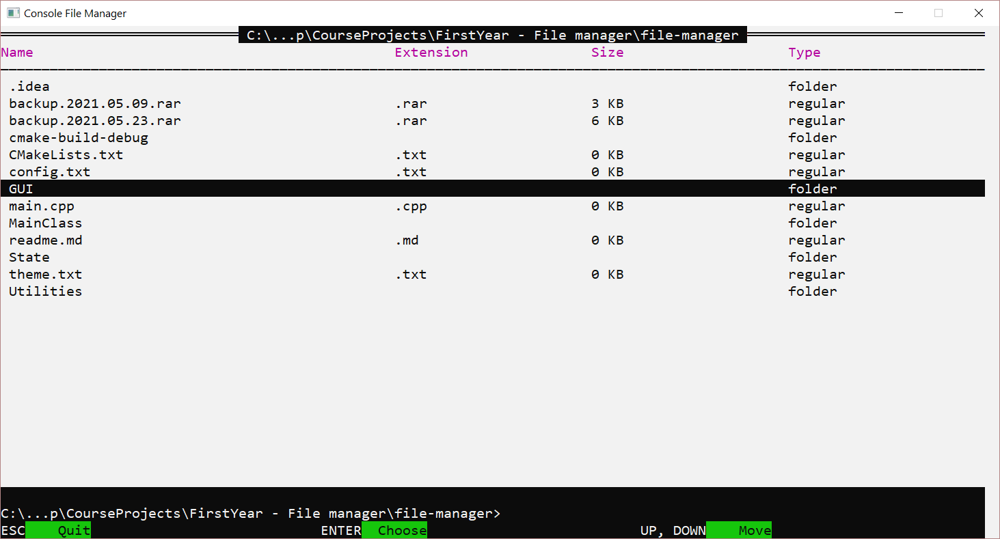

# Консольный файловый менеджер

&nbsp;

### Используемый стек: _C++ 17_, _WinAPI_

### Разработка в: _JetBrains Clion_

&nbsp;

#### Цели:

* _применить подход раздельного реактивного рендера псевдокомпонентов в консоли_
* _научить консоль работать с пользовательскими событиями_
* _научить консоль выглядеть похожей на обычное десктопное оконное приложение_

#### Особенности:

* _чистый C++ и WinAPI (встроенная библиотека - windows.h)_
* _новый стандарт языка — С++ 17_
* _подход раздельного "рендера компонентов"_  
  &nbsp;

#### Демонстрация:

&nbsp;

###### © 2021. Слуцкий Никита, студент группы 053501 (БГУИР / ФКСиС / ИиТП) 