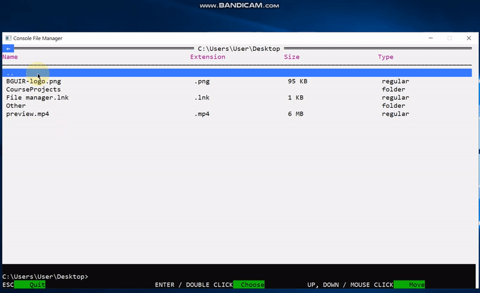

## _Subject: __Programming___

# Deep modification of standard Windows console and creation of a File Manager based on it

&nbsp;

#### Purposes:

* _Teach console to work with custom events (mouse & keyboard)_
* _Apply the approach of separate rendering of pseudo-components in interface_
* _Try to implement something, at least a little bit similar to [React](https://reactjs.org/)
        - [Redux](https://redux.js.org/) - [RxJS](https://rxjs.dev/) concept_
* _Teach console to look & behave similar to desktop Window application (as example - FAR Manager)_

#### Features:

* _Pure C++ , only default Windows console & WinAPI (built-in libraries windows.h & winuser.h)_
* _Modern language standard: C++ 17_
* _[Google C++ Style Guide (CodeStyle)](https://google.github.io/styleguide/cppguide.html)_
* _Building interaction among entities (classes) for rendering, listening events, etc._
* _Separate component-rendering only when needed_
* _3 main entities a little like in [React](https://reactjs.org/) - [Redux](https://redux.js.org/) - [RxJS](https://rxjs.dev/) concept: AppState => store, GUI => component, EventsController => events subscriber_

#### Functionality:

* _Full mouse (wheel & clicks) and keyboard navigation_
* _Creating & removing items via pseudo-modals (pop-ups)_
* _Browsing and navigation through folders_
* _Opening files via default programs declared in Windows_
* _Setting color-palettes from the separate theme file_
* _Saving the history of directories visits_

#### Demo:

&nbsp;  
&nbsp;

#### Technologies used:

* _C++_
    * _C++ 17 (almost only features from C++ 11 and newer)_
    * _WinAPI (only console API)_
    * _Standard Template Library_

#### Developed in:

* _JetBrains Clion_
  &nbsp;  
  &nbsp;

###### _Copyright © 2021 | All rights reserved_
