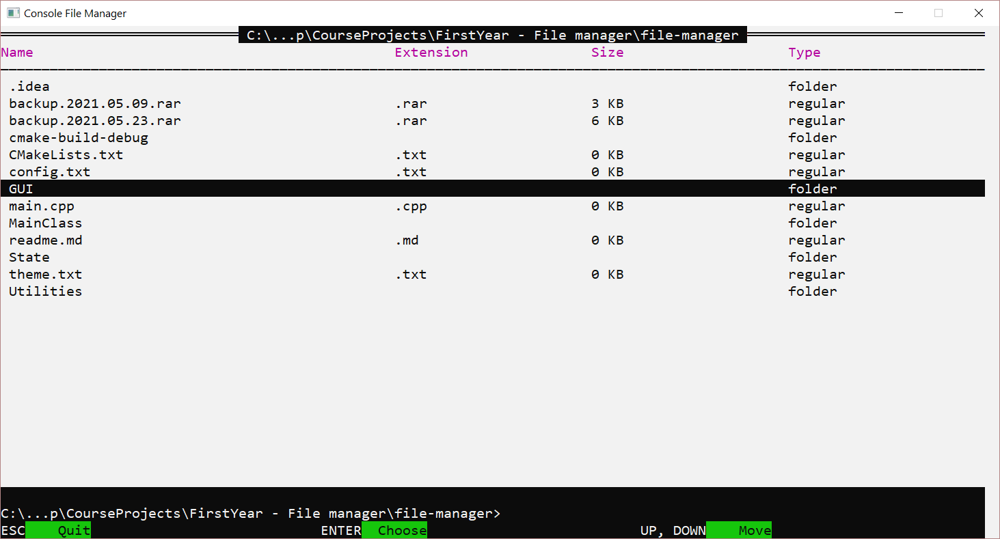

# Console File manager

&nbsp;

### Technologies used: _C++ 17_, _WinAPI_

### Developed in: _JetBrains Clion_

&nbsp;

#### Purposes:

* _Apply the approach of separate rendering of pseudo-components in console_
* _Teach console to work with custom events_
* _Teach console to look like a normal desktop window application_

#### Features:

* _Pure C++ and WinAPI (built-in libraries windows.h & winuser.h)_
* _New language standard: C++ 17_
* _Separate "component rendering"_

#### Functionality:

* _Browsing and navigation through folders_
* _Mouse and keyboard navigation_
* _Saving the history of directories visits_

#### Demo:

&nbsp;  
&nbsp;  

###### _Copyright © 2021_   
###### **Slutski Nikita**  
###### _Student of group 053501_  
###### _BSUIR  |  Faculty of Computer Systems & Networks  |  Computer Science & Programing Technologies_
