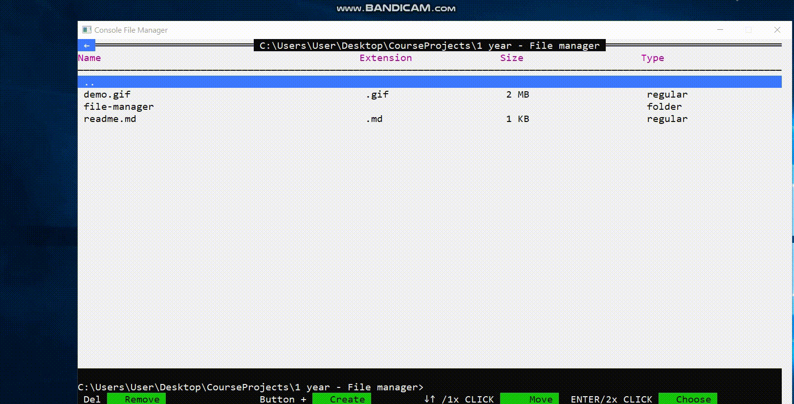

# Console File manager

&nbsp;

#### Purposes:

* _Teach console to work with custom events (mouse & keyboard)_
* _Apply the approach of separate rendering of pseudo-components in interface_
* _Teach console to look similar to desktop Window application_

#### Features:

* _Pure C++ , only default Windows console & WinAPI (built-in libraries windows.h & winuser.h)_
* _Modern language standard: C++ 17_  
* _Google C++ Style Guide (CodeStyle)_
* _Building interaction among entities (classes) for rendering, listening events, etc._

#### Functionality:

* _Browsing and navigation through folders_
* _Full mouse (wheel & clicks) and keyboard navigation system support_
* _Creating & removing items via pseudo-modals (pop-ups)_
* _Setting color-palettes from the separate theme file_
* _Saving the history of directories visits_
* _Opening files via default programs declared in Windows_

#### Demo:

&nbsp;  
&nbsp;

#### Technologies used:

* _C++_
    * _C++ 17_
    * _WinAPI_
    * _Standard Template Library_

#### Developed in:

* _JetBrains Clion_

###### _Copyright © 2021_

###### **Slutski Nikita**

###### _Student of group 053501_

###### _BSUIR | Faculty of Computer Systems & Networks | Computer Science & Programming Technologies_
